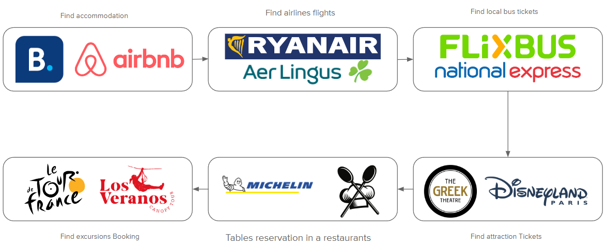
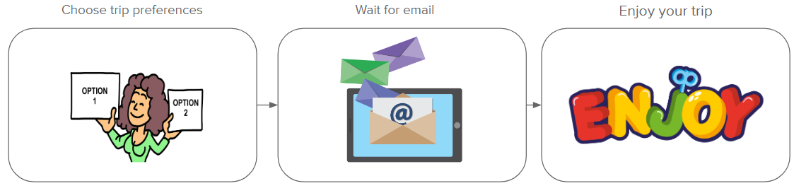
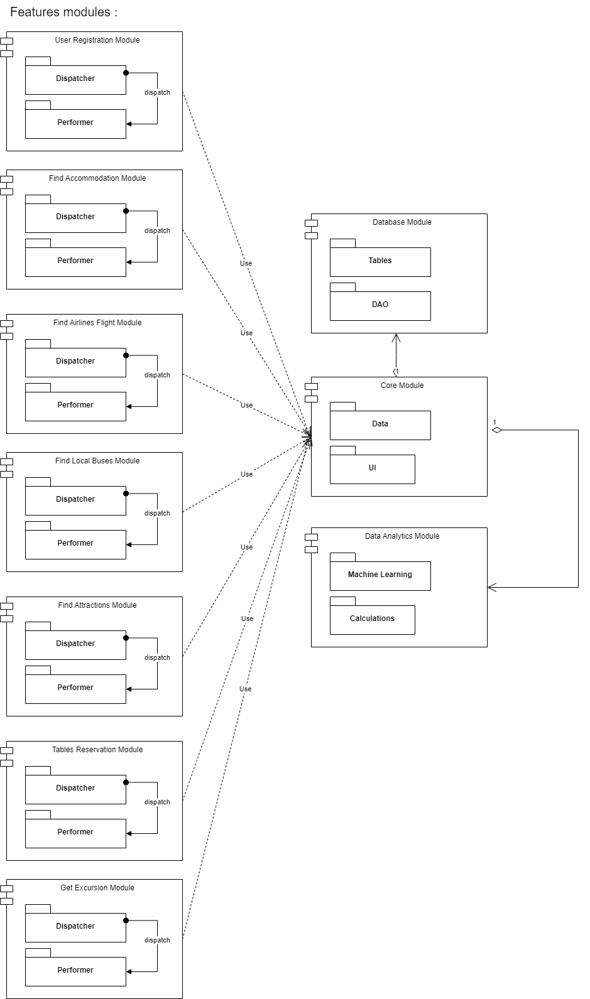
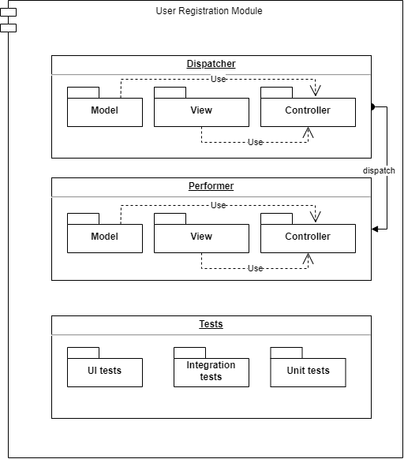

# **Trip planner RPA group project**

## **1. Overview.**

Our trip planner robot allows you to select your trip preferences. Once you provide your preferences, the robot gathers all the necessary information about trip options. It then compiles a detailed email and sends it to your inbox, including all the relevant details. You can simply review the options presented in the email, choose your desired trip, and start enjoying your vacation. You could find more information about processes in Documenation Folder.

## **Contents:**

1. [Project Overview](#1-overview)
2. [AS - IS diagram](#2-as-is-diagram)
3. [TO - BE diagram](#3-to-be-diagram)
4. [Software architecture overview](#4-software-architecture-overview)
5. [Features](#5-features)
   - [User registration](#user-registration)
   - [Find accommodation](#find-accommodation)
   - [Find airlines flights](#find-airlines-flights)
   - [Find local bus tickets](#find-local-bus-tickets)
   - [Find attraction tickets](#find-attraction-bus-tickets)
   - [Tables reservation in a restaurants](#tables-reservation)
   - [Excursions booking ](#excursions-booking)
   - [Account Page](#account-page)
   - [Register, Login/logout](#register-loginlogout-pages)
   - [Basket Page](#shopping-basket)
   - [Checkout Page](#checkout-page)

## **2. AS - IS diagram:**

With the usual approach, an employee of a travel agency spends from one to two hours to select the most suitable offer for one buyer. By visiting all the sites shown in the AS - IS diagram.

## **3. TO - BE diagram:**

This process can be easily automated by our robot.

## **4. Software architecture overview:**

High-level architecture. Our robot, you can see that there are 7 feature sub-modules, each of which corresponds to one sprint. Separately, Dispatcher and Performer were developed for each of the modules.

Core Modeule . As you can see from the diagram, it is the most independent module which contains 2 layers:

1.  UI - contains processes that can be used many times in different modules and that interact with the user interface
2.  Data - contains processes that can be used many times in different modules and that interact exclusively with data

The Database module. This modile contains sequences of interaction with a relational database and consists of two layers:

1.  Tables - encapsulates the logic of creating and managing databases tables
2.  DAO (Data Access Object) - contains the logic of interaction with data that contains in data tables

The Data Analytics module contains the neural network training logic and the data analysis logic; it consists of 2 layers:

1.  Machine learning - encapsulates the logic of interaction with a neural network
2.  Calculations - contains the calculation logic for data analysis

Lower level architecture. Each feature module consists of three layers:

1.  Dispatcher - it delivers data from different sources
2.  Performer - processes data provided by DispatcherEach of these salts is divided into sublayers
    - Model - it contains sequences that directly interact with data models, transform and process them
    - View - there are sequences that interact with I / O interfaces
    - Controller - there are sequences that connect Model and View and perform intermediate data manipulations
3.  Tests - here the testing sequences can be divided into 3 sub-layers:
    - UI tests - they test the correct interaction of processes with a visual display
    - Integration tests - test the correctness of the interaction between Model , View , Controller under layers
    - Unit testing - tests each sequence in isolation for a specific job

## **5. Features.**

### User registration

With this function, the user creates an owl profile, fills in the data about the trips he wants to make, we save this data and process it in the future with the help of performers.

### Find accommodation

In process

### Find airlines flights

In process

### Find local bus tickets

In process

### Find attraction tickets

In process

### Tables reservation in a restaurants

In process
